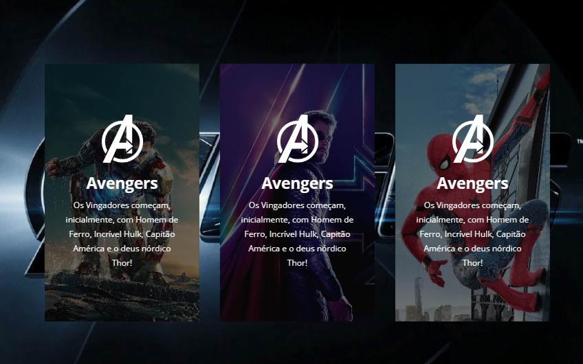

# Projeto os Vigadores

## Layout do projeto em tela de Desktop/Notebook/Tablet/Mobile.

<div align="center">

  

  

</div>

### O que aprendi

```css
.flip-card-front .inner,
.flip-card-back .inner {
  width: 100%;
  position: absolute;
  top: 50%;
  transform: translateY(-50%) translateZ(60px) scale(0.94);
  z-index: 2;
  padding: 40px;
}

.flip-card:hover .flip-card-front {
  transform: rotateY(-180deg);
}

.flip-card:hover .flip-card-back {
  transform: rotateY(0deg);
}
```

### Construído com

- Marcação semântica HTML5
- Propriedades personalizadas CSS
- Caixa flexível
## Desenvolvido em:

<div>
  
  
</div>
